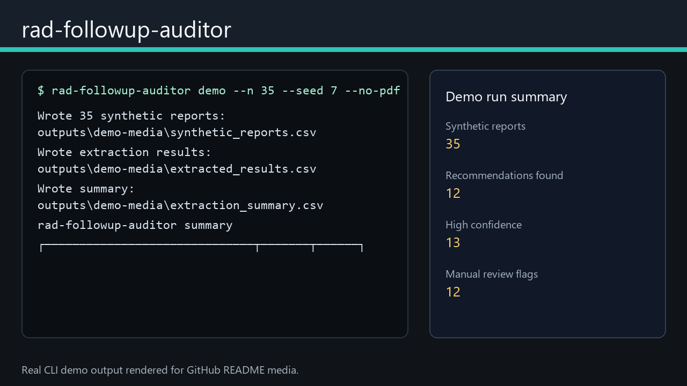

# rad-followup-auditor

[](https://github.com/AKaturu/rad-followup-auditor/actions/workflows/ci.yml)
[](https://github.com/AKaturu/rad-followup-auditor/actions/workflows/release.yml)
[](https://www.python.org/)
[](LICENSE)

**Extract, structure, and audit incidental finding follow-up recommendations from radiology reports.**



Incidental findings often include free-text recommendations such as "CT chest in 6 months" or "MRI abdomen recommended." Those recommendations can be hard to monitor across a large report corpus. This project turns report text into reviewable CSV outputs so teams can audit follow-up language, find ambiguous recommendations, and prioritize manual review.

## Evidence Status

| Evidence | Status |
|---|---|
| Unit and integration tests | Complete (58 tests) |
| Synthetic end-to-end evaluation | Complete |
| Synthetic validation benchmark | Complete (300 reports; recommendation F1 0.966) |
| Public-data evaluation | Not completed |
| Independent expert review | Not completed |
| Institutional validation | Not completed |
| Prospective clinical validation | Not completed |

This software is a research prototype and is not intended for independent clinical decision-making.

## Capabilities

- Parses free-text radiology reports for follow-up recommendations
- Converts recommendations to structured fields: finding, modality, interval, urgency, anatomic region
- Detects negated recommendations ("No follow-up needed")
- Assigns confidence levels and flags cases needing manual review
- Generates CSV/JSON summaries and HTML reports with optional PDF export
- Supports local custom recommendation regexes and false-positive exclude lists
- Streamlit dashboard for interactive review with CSV/JSON downloads

## Quick Start

```bash
pip install -e ".[app]"
rad-followup-auditor demo --output outputs/demo --n 50 --seed 42 --no-pdf
rad-followup-auditor serve
```

Custom local rules can be supplied to CLI extraction:

```bash
rad-followup-auditor extract --csv reports.csv --output outputs/extract \
  --custom-patterns local_rules.json \
  --exclude-patterns false_positive_excludes.txt
```

`local_rules.json` may contain `recommendation_patterns` and `exclude_patterns`.
Plain text exclude files are also supported with one regex per line.

For reviewer-adjudicated validation, create reviewer templates and compute agreement:

```bash
rad-followup-auditor review-template outputs/extract/extracted_results.csv reviewer_a.csv --reviewer-id A
rad-followup-auditor review-template outputs/extract/extracted_results.csv reviewer_b.csv --reviewer-id B
rad-followup-auditor reviewer-agreement reviewer_a.csv reviewer_b.csv reviewer_agreement.json
```

## Input CSV Format

```csv
report_id,report_text
R001,"FINDINGS: 8 mm pulmonary nodule in the right upper lobe. IMPRESSION: Recommend CT chest in 6 months."
R002,"FINDINGS: Normal examination. IMPRESSION: No further imaging recommended."
```

## Output Fields

| Field | Meaning |
|---|---|
| `finding` | Finding requiring follow-up, such as `pulmonary nodule`. |
| `recommended_modality` | CT, MRI, ultrasound, or other recommended modality. |
| `interval_value` / `interval_unit` | Follow-up timing, such as `6 months`. |
| `urgency` | Routine, urgent, or other urgency label. |
| `anatomic_region` | Body region inferred from the recommendation. |
| `confidence` | High, medium, or low extraction confidence. |
| `review_required` | Boolean flag for manual review. |
| `is_negated` | Recommendation was negated or explicitly unnecessary. |

## Validation Benchmark

The repository includes a deterministic 300-report synthetic benchmark corpus at `tests/data/validation_reports.csv` and a validation runner:

```bash
python scripts/build_validation_corpus.py
python scripts/run_validation.py tests/data/validation_reports.csv outputs/validation
```

Current synthetic benchmark results:

| Metric | Value |
|---|---:|
| Reports | 300 |
| Recommendation sensitivity | 1.000 |
| Recommendation precision | 0.934 |
| Recommendation F1 | 0.966 |
| Macro field accuracy | 0.773 |
| Exact all-field match | 0.223 |

See [docs/validation/validation_report.md](docs/validation/validation_report.md) for field-level metrics, category summaries, limitations, and next validation steps. These results are useful for regression testing and method transparency, but they are not clinical performance claims.

## Demo Media

The README animation is generated from a real synthetic CLI demo run:

```bash
python -m pip install -e ".[media]"
python scripts/generate_demo_media.py
```

See [docs/demo-media.md](docs/demo-media.md) for details.

## Releases

Download the current Windows, macOS, or Linux archive from the [Releases page](https://github.com/AKaturu/rad-followup-auditor/releases). SHA-256 checksum sidecars are attached to the release assets.

See [docs/release.md](docs/release.md) for release steps.

## Limitations

- This tool is for research, quality improvement, and workflow prototyping
- It is not a medical device and should not be used as the sole source for clinical decisions
- Use synthetic or properly de-identified report text unless your institution has approved a compliant local workflow

## Documentation

| Topic | File |
|---|---|
| Release steps | [docs/release.md](docs/release.md) |
| Demo media generation | [docs/demo-media.md](docs/demo-media.md) |
| Human review and agreement | [docs/HUMAN_REVIEW.md](docs/HUMAN_REVIEW.md) |
| Validation benchmark | [docs/validation/validation_report.md](docs/validation/validation_report.md) |
| Contribution guide | [CONTRIBUTING.md](CONTRIBUTING.md) |
| Security reporting | [SECURITY.md](SECURITY.md) |

## License

MIT. See [LICENSE](LICENSE).
